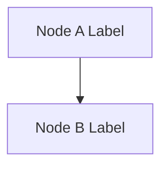
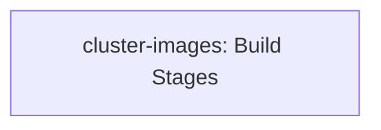
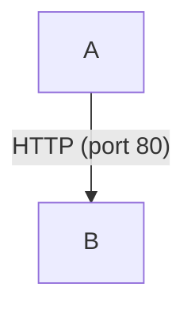
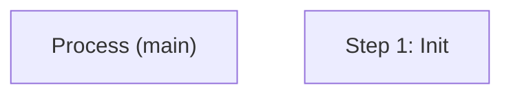
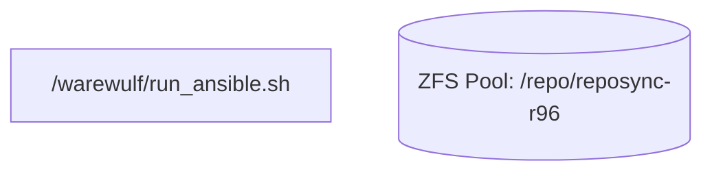
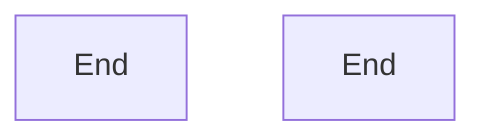
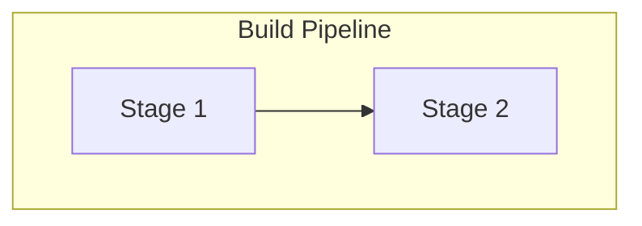

# Agent Documentation Update Instructions

> **Document Type:** Meta-Documentation / Agent Runbook  
> **Purpose:** Instructions for AI agents performing regular updates to this tree
> **Last Updated:** 2026-03-20

---

## 1. Mermaid Diagram Guidelines

Mermaid diagrams are used extensively throughout the documentation. When creating or updating diagrams, follow these rules carefully to ensure they render correctly across all viewers (GitHub, GitLab, VSCode, web browsers).

### Supported Diagram Types

| Type | Use For | Syntax Start |
|------|---------|-------------|
| Flowchart | Architecture, data flow, component relationships | `flowchart TB` or `flowchart LR` |
| State diagram | Node lifecycle, boot process, state transitions | `stateDiagram-v2` |
| Sequence diagram | Request/response flows, multi-party interactions | `sequenceDiagram` |
| Graph | Layer stacks, dependency trees | `graph TD` or `graph LR` |

### Rendering Rules — MUST Follow

These rules prevent common rendering failures:

#### 1. No spaces in node IDs



```
%% BAD — spaces in IDs cause parse errors
flowchart TB
    Node A[Node A Label] --> Node B[Node B Label]
```

#### 2. No HTML tags in labels



```
%% BAD — <br/> renders as literal text or breaks parsing
flowchart TB
    A[cluster-images<br/>Build Stages]
```

**Note:** Some existing documents use `<br/>` in Mermaid labels. When updating these diagrams, replace `<br/>` with either separate nodes, parenthetical text, or line breaks using the quoted label syntax where supported by the renderer.

#### 3. Quote edge labels containing special characters



```
%% BAD — parentheses parsed as node syntax
flowchart TB
    A -->|HTTP (port 80)| B
```

#### 4. Double-quote node labels with special characters



```
%% BAD — parentheses and colons break parsing
flowchart TB
    A[Process (main)]
    B[Step 1: Init]
```

#### 4a. Always quote labels containing forward slashes or file paths

A leading `/` inside `[...]` is parsed as mermaid's **trapezoid shape syntax** (`[/ text /]`), not as a file path. Any label containing `/` must be double-quoted.



```
%% BAD — leading / parsed as trapezoid shape, causes lexical error
flowchart TB
    SCRIPT[/warewulf/run_ansible.sh]
```

This also applies to labels with embedded `/` characters (e.g., `repo-scripts/*.sh`, `/etc/slurm/slurm.conf`). Always wrap in double quotes.

#### 5. Avoid reserved keywords as node IDs

Reserved words: `end`, `subgraph`, `graph`, `flowchart`, `classDef`, `class`, `click`, `style`



```
%% BAD — 'end' conflicts with subgraph syntax
flowchart TB
    end[End]
```

#### 6. Use explicit IDs with labels for subgraphs



```
%% BAD — spaces in subgraph name cause parsing issues
flowchart TB
    subgraph Build Pipeline
        A[Stage 1] --> B[Stage 2]
    end
```

#### 7. Do NOT use explicit colors or styling

Explicit colors break dark mode rendering and create inconsistent appearance:

```
%% BAD — avoid all of these
style A fill:#fff
classDef myClass fill:white
A:::someStyle
```

Let the default theme handle all colors.

#### 8. No click events

Click events are disabled in most secure renderers. Do not use `click` syntax.

### Validation Checklist

After creating or modifying any Mermaid diagram, verify:

- [ ] Every `subgraph` has a matching `end`
- [ ] All brackets, parentheses, and quotes are balanced
- [ ] No spaces in node IDs
- [ ] No HTML tags (`<br/>`, `<b>`, etc.) in labels
- [ ] No reserved keywords used as node IDs
- [ ] No explicit color/style directives
- [ ] Edge labels with special characters are quoted
- [ ] Node labels with special characters are double-quoted
- [ ] Diagram renders correctly (test in a Mermaid live editor if possible)
- [ ] Diagram conveys the intended information clearly

### ASCII Art as Alternative

For simple topologies that must render everywhere (including plain text viewers), use ASCII art:

```
┌─────────────────────────────────────────────────────────────────┐
│                     Component Name                               │
├─────────────────────────────────────────────────────────────────┤
│  ┌─────────────┐  ┌─────────────┐  ┌─────────────┐             │
│  │  Sub-comp A │  │  Sub-comp B │  │  Sub-comp C │             │
│  └─────────────┘  └─────────────┘  └─────────────┘             │
└─────────────────────────────────────────────────────────────────┘
```

Use Mermaid for complex flowcharts, state machines, and sequences. Use ASCII art for simple box diagrams and network topologies.

### Auditing Existing Diagrams

When performing an update pass, audit all Mermaid diagrams in modified documents against the rules above. Fix any violations found, even if they pre-date your changes. Common issues in existing docs:
- `<br/>` tags in node labels (replace with quoted labels or separate nodes)
- Unquoted labels containing parentheses or colons
- Subgraphs with spaces in names lacking explicit IDs

### Mermaid Diagram Checking Procedure

This section provides a concrete, step-by-step procedure for validating Mermaid diagrams. Run these checks **before committing** any changes to markdown files. The checks below were derived from real bugs found in this repository (commits `1becc9a` through `808c01c`, all requiring manual repair of agent-generated diagrams).

#### Why Agents Keep Making These Mistakes

LLM training data contains many Mermaid examples that use `<br/>` for line breaks inside node labels. This pattern appears frequently on Stack Overflow, in tutorials, and in older documentation. However, `<br/>` renders as **literal text** or **causes parse errors** in GitLab, GitHub, and VSCode Mermaid renderers. Agents must override the inclination to use `<br/>` and instead use the quoted-label alternatives documented here. This is the single most common source of broken diagrams in this repository.

#### Step 1: Run Automated Searches

After creating or modifying any markdown file containing Mermaid diagrams, run these searches against the modified files. Every match is a violation that must be fixed before committing.

**Search 1 — HTML tags in Mermaid blocks:**

```bash
# Find <br/>, <br>, <b>, or any HTML tag inside mermaid code blocks
grep -n '<br\s*/\?>' machine-generated/**/*.md
grep -n '<[a-z]\+>' machine-generated/**/*.md
```

Any `<br/>` or `<br>` match inside a mermaid code block must be replaced using the remediation patterns below.

**Search 2 — Subgraphs without explicit IDs:**

```bash
# Find subgraphs that use a quoted label but no ID before it
grep -n 'subgraph "' machine-generated/**/*.md
```

Valid subgraphs have an ID before the quoted label: `subgraph myId ["My Label"]`. A match of `subgraph "My Label"` (no ID) means any edge referencing that subgraph by name will break.

**Search 3 — Unquoted labels with special characters:**

```bash
# Find node labels containing parentheses or colons without double quotes
grep -nE '\[[A-Za-z].*[:(].*[^"]]\]' machine-generated/**/*.md
```

Node labels containing parentheses, colons, or other special characters must be wrapped in double quotes inside the brackets.

**Search 4 — Unquoted forward slashes in labels:**

```bash
# Find node labels starting with / (parsed as trapezoid shape) or containing file paths
grep -nE '\[[^"]*/' machine-generated/**/*.md
```

Any `[/path/...]` match inside a mermaid code block will cause a lexical error. The leading `/` is interpreted as mermaid's trapezoid shape syntax. Fix by quoting: `["/path/to/file"]`.

**Search 5 — Reserved keywords as node IDs:**

```bash
# Find reserved words used as node IDs (followed by [ which starts a label)
grep -nE '^\s+(end|subgraph|graph|flowchart|classDef|class|click|style)\[' machine-generated/**/*.md
```

These keywords conflict with Mermaid syntax and must be renamed (e.g., `end` becomes `endNode`).

#### Step 2: Apply Remediation Patterns

When a violation is found, apply the appropriate fix from this table. All examples are drawn from actual fixes made to this repository.

| Anti-Pattern | Bad Example | Correct Fix | Technique |
|-------------|-------------|-------------|-----------|
| `<br/>` between two items | `A[slurmctld<br/>Primary Controller]` | `A["slurmctld: Primary Controller"]` | Join with colon in quoted label |
| `<br/>` between multiple items | `A[roles/<br/>slurm-server<br/>slurm-client]` | `A["roles: slurm-server, slurm-client"]` | Join with commas in quoted label |
| `<br/>` for visual separator | `A["Slurm 25.05<br/>━━━━━━<br/>slurmctld"]` | `A["Slurm 25.05: slurmctld, slurmd, slurmdbd"]` | Flatten to single descriptive line |
| Subgraph without explicit ID | `subgraph "GCP Project"` | `subgraph gcpProject ["GCP Project"]` | Add camelCase ID before quoted label |
| Edge referencing subgraph name with spaces | `FW --> Management Subnet` | `FW --> mgmtSubnet` | Reference the explicit subgraph ID |
| Unquoted label with parentheses | `A[Process (main)]` | `A["Process (main)"]` | Wrap label in double quotes |
| Unquoted label with colon | `A[Step 1: Init]` | `A["Step 1: Init"]` | Wrap label in double quotes |
| Unquoted edge label with special chars | `A -->\|HTTP (port 80)\| B` | `A -->\|"HTTP (port 80)"\| B` | Wrap edge label in double quotes |
| Forward slash in unquoted label | `SCRIPT[/warewulf/run_ansible.sh]` | `SCRIPT["/warewulf/run_ansible.sh"]` | Quote label -- leading `/` is trapezoid shape syntax |
| File path in database node | `ZFS[(ZFS Pool<br/>/repo/reposync-r96)]` | `ZFS[("ZFS Pool: /repo/reposync-r96")]` | Quote label with colon separator; `()` for database shape |
| Quadrant chart label too long | `Repository Supply Chain: [0.75, 0.70]` | `Repo Supply Chain: [0.75, 0.70]` | Shorten label text |
| Duplicate node ID across subgraphs | `ZFS` used in both "repomaker" and "backups" subgraphs | `ZFSPOOL` in repomaker, `ZFSBACK` in backups | Use unique IDs even across subgraphs |

#### Step 3: Verify Structural Integrity

After applying fixes, verify the structural integrity of each diagram:

1. **Balanced delimiters** — Every `subgraph` must have a matching `end`. Count them; the numbers must match within each diagram.
2. **Balanced brackets and quotes** — Every `[` has a `]`, every `(` has a `)`, every `"` has a closing `"`.
3. **Consistent subgraph references** — Every edge that targets a subgraph must use the subgraph's explicit ID (the camelCase identifier), not the display label.
4. **No orphaned nodes** — Every defined node should be connected to at least one edge.

#### Step 4: Cross-File Consistency

Several diagrams in this repository appear in multiple files (e.g., a diagram in an outline file `aicr-systems-stack-expert-overview-outline/XX-*.md` is also in `all.md`, and may appear in the corresponding `expanded-system-overview/XX-*/README.md`). When fixing a diagram:

1. Search for the same diagram in related files (outline, combined outline `all.md`, expanded section).
2. Apply the same fix to all copies.
3. Verify that no copy was missed.

The four fix commits (`1becc9a` through `4d5ced8`) each had to touch 3 files because the same broken diagram existed in the outline, `all.md`, and the expanded section.

---
