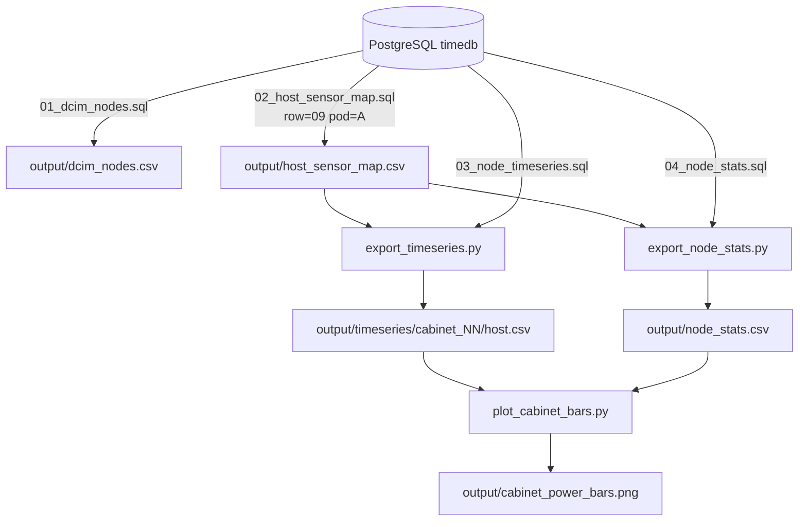

## Goal

Implement the `[telegraf_data/AGENT_INSTRUCTIONS.md](telegraf_data/AGENT_INSTRUCTIONS.md)` spec from scratch in a new top-level directory, fixing three deviations the existing `telegraf_data/` code has:

1. Add `sys_power` to the sensor set, with the rule "if a host reports both `sys_power` and `instantaneous_power_reading`, `sys_power` is authoritative".
2. Export `dcim_nodes` with all four spec columns: `name, row, pod, rack`.
3. Include all cabinets in row 9 / pod A (don't drop `01`/`31`).

I will reuse useful patterns from `[telegraf_data/query_pg.py](telegraf_data/query_pg.py)` (psycopg2 connection, host-name `split_part(node_name,'-',1)` matching, per-cabinet batching) but write fresh code with proper parameterization, no DuckDB dependency, and clean orchestration.

## New directory layout

```text
r9_pod_a_pipeline/
  README.md                      # docs role: how-to, design rationale, verification
  DESIGN.md                      # architect role: parameter map + reuse notes
  requirements.txt               # psycopg2-binary, matplotlib, numpy
  config.py                      # defaults + argparse helpers (row, pod, time window, sensors, output dir)
  pg_client.py                   # shared PG connection (env var PGPASSWORD)
  sql/
    01_dcim_nodes.sql            # all dcim_nodes rows -> name,row,pod,rack
    02_host_sensor_map.sql       # per-host preferred sensor, applies sys_power rule + name irregularity
    03_node_timeseries.sql       # 10-minute bucketed time-series for chosen (host,sensor) pairs
    04_node_stats.sql            # per-host min/avg/max from chosen sensor
  pipeline/
    export_dcim_nodes.py         # step 1
    export_host_sensor_map.py    # step 2a (writes the (host,preferred_sensor) CSV)
    export_timeseries.py         # step 2b (per-host CSVs under output/timeseries/<cabinet>/)
    export_node_stats.py         # step 2c (per-host min/avg/max)
    plot_cabinet_bars.py         # step 3 (4 bars per cabinet)
  run_pipeline.py                # one-shot orchestrator
  output/                        # generated, gitignored except .gitkeep
```

## Role-by-role artifacts

### 1. DB-expert role -> `sql/*.sql`

- `01_dcim_nodes.sql` -> `SELECT node_name AS name, row_number AS row, pod, cabinet_number AS rack FROM public.dcim_nodes ORDER BY name`.
- `02_host_sensor_map.sql` -> for each `i.host` that maps to a non-chassis `dcim_nodes` row in the requested row/pod, pick the preferred sensor:

```sql
WITH node_hosts AS (
  SELECT DISTINCT split_part(node_name, '-', 1) AS host,
                  cabinet_number AS rack
  FROM public.dcim_nodes
  WHERE row_number = %(row)s
    AND pod = %(pod)s
    AND node_name NOT LIKE '%%-chassis'
),
host_sensors AS (
  SELECT DISTINCT i.host, i.name AS sensor
  FROM telegraf.ipmi_sensor i
  JOIN node_hosts nh ON nh.host = i.host
  WHERE i.name IN ('sys_power','instantaneous_power_reading','pwr_consumption')
    AND i.time BETWEEN %(start)s AND %(end)s
)
SELECT nh.host, nh.rack,
       CASE
         WHEN bool_or(hs.sensor = 'sys_power')                    THEN 'sys_power'
         WHEN bool_or(hs.sensor = 'instantaneous_power_reading')  THEN 'instantaneous_power_reading'
         WHEN bool_or(hs.sensor = 'pwr_consumption')              THEN 'pwr_consumption'
         ELSE NULL
       END AS preferred_sensor
FROM node_hosts nh
LEFT JOIN host_sensors hs USING (host)
GROUP BY nh.host, nh.rack
ORDER BY nh.rack, nh.host;
```

This is the single place that encodes both the host-name irregularity (`split_part`, drop `-chassis`) and the `sys_power`-authoritative rule.

- `03_node_timeseries.sql` -> uses the (host, preferred_sensor) pairs as a values list:

```sql
SELECT time_bucket('10m', i.time) AS time, i.host, MAX(i.value) AS power_watts
FROM telegraf.ipmi_sensor i
JOIN (VALUES %s) AS pref(host, sensor)
  ON pref.host = i.host AND pref.sensor = i.name
WHERE i.time BETWEEN %(start)s AND %(end)s
GROUP BY 1, 2
ORDER BY 1, 2;
```

- `04_node_stats.sql` -> same join, returns `host, min_power, avg_power, max_power` (raw samples, not bucketed).

### 2. Software-engineer role -> Python scripts

- `pg_client.py`: thin `connect()` returning a psycopg2 connection from `config.PG_*` and `os.environ['PGPASSWORD']`; raises a clear error if missing.
- `pipeline/export_dcim_nodes.py`: runs `01_dcim_nodes.sql`, writes `output/dcim_nodes.csv`.
- `pipeline/export_host_sensor_map.py`: runs `02_host_sensor_map.sql` with `(row, pod, start, end)`, writes `output/host_sensor_map.csv` (drops rows where `preferred_sensor IS NULL` and prints how many were dropped).
- `pipeline/export_timeseries.py`: reads `host_sensor_map.csv`, batches by cabinet, executes `03_node_timeseries.sql` per cabinet using `psycopg2.extras.execute_values`-style VALUES expansion, splits result by host, writes `output/timeseries/cabinet_<rack>/<host>.csv`.
- `pipeline/export_node_stats.py`: reads `host_sensor_map.csv`, runs `04_node_stats.sql`, writes `output/node_stats.csv` (used only for per-host max -> potential max).
- `pipeline/plot_cabinet_bars.py`: produces 4 bars per cabinet, in kW, saved to `output/cabinet_power_bars.png`. Bar definitions (matching the spec literally, NOT the existing `plot_cabinet_bars.py` which sums per-node mins/means):
  - **Instantaneous min** = `min_t( sum_h power(h,t) )` over the cabinet.
  - **Average** = `mean_t( sum_h power(h,t) )`.
  - **Instantaneous max** = `max_t( sum_h power(h,t) )`.
  - **Potential max** = `sum_h max_t power(h,t)` (each node's individual peak summed — not simultaneous).
- `run_pipeline.py`: argparse front-end, calls the four `export_*` scripts then `plot_cabinet_bars`. Flags: `--row`, `--pod`, `--start`, `--end`, `--output-dir`, `--bucket` (default `10m`), `--skip-export`.

### 3. Architect role -> `DESIGN.md`

Short doc covering:
- Parameter surface (`config.py` + CLI flags) and what's intentionally NOT parameterized (sensor priority list — that's a domain rule).
- Reuse map: which patterns came from `telegraf_data/query_pg.py` and which were replaced and why.
- Data-flow diagram (mermaid) showing SQL -> CSV -> plot.
- How to extend to other rows/pods/clusters: change `--row`/`--pod` and re-run; the SQL is parameterized.

### 4. Docs role -> `README.md`

- One-paragraph purpose.
- Setup (`python -m venv .venv && pip install -r requirements.txt`, `export PGPASSWORD=...`).
- Quickstart (`python run_pipeline.py --row 09 --pod A`).
- Output layout description.
- "How to verify": cross-check `dcim_nodes.csv` row count against `psql` count, spot-check one host CSV against `[telegraf_data/example_node_ts_query.sql](telegraf_data/example_node_ts_query.sql)`, confirm `host_sensor_map.csv` shows `sys_power` for hosts that have it.
- Known irregularities (host-name `split_part`, `-chassis` exclusion, hosts with no power data).

## Data flow



## Out of scope

- No DuckDB cache (the spec doesn't ask for it; CSVs are the deliverable).
- No masking / random-selection variant (that's the `[telegraf_data/plot_cabinet_bars_masked.py](telegraf_data/plot_cabinet_bars_masked.py)` extension, not in the spec).
- No modifications to anything under `telegraf_data/`.