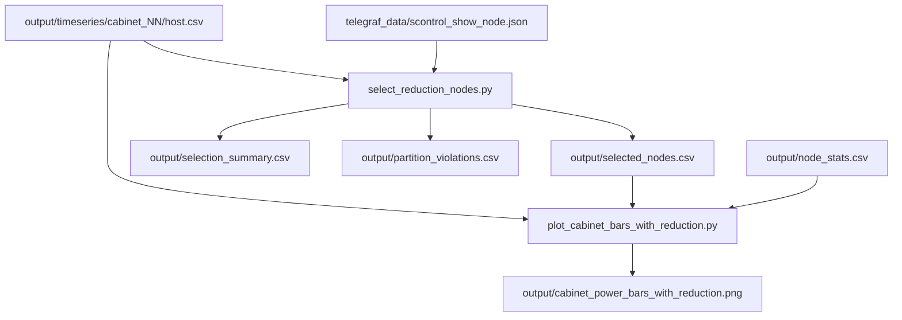

## Goal

Mirror the at-peak selection semantics already used by [`telegraf_data/select_nodes.py`](telegraf_data/select_nodes.py), but (a) consume the new pipeline's CSVs (`power_watts` column instead of `max_power`; per-host CSVs without a `host` column), (b) add a hard partition-floor constraint sourced from [`telegraf_data/scontrol_show_node.json`](telegraf_data/scontrol_show_node.json), and (c) implement the seeded retry / best-effort fallback the user spec'd.

## What gets added

Two new files plus small edits to the orchestrator, README, and DESIGN.

```text
r9_pod_a_pipeline/
  pipeline/
    select_reduction_nodes.py            # NEW - main algorithm
    plot_cabinet_bars_with_reduction.py  # NEW - clone of plot with extra "after" bar
  run_pipeline.py                         # MODIFIED - new --with-reduction flag
  README.md                               # MODIFIED - document the new step
  DESIGN.md                               # MODIFIED - add parameter surface
  output/                                 # new outputs
    selected_nodes.csv                    # NEW
    selection_summary.csv                 # NEW
    partition_violations.csv              # NEW (empty header-only when feasible)
    cabinet_power_bars_with_reduction.png # NEW
```

`telegraf_data/AGENT_INSTRUCTIONS.md` gets a short addendum pointing at the new step.

## Algorithm

For each of `--max-attempts` (default 100) seeded attempts:

1. **Per-cabinet selection.** For each cabinet, using a seeded `random.Random(seed)`:
   - Compute `peak_time` = `argmax_t T(t)` where `T(t) = sum_h power(h, t)` over hosts in the cabinet (from `output/timeseries/cabinet_NN/<host>.csv`).
   - Compute `host_power_at_peak[h] = power(h, peak_time)` (0 if host has no reading at that timestamp).
   - Shuffle the cabinet's hosts, then accumulate selected hosts in shuffle order until cumulative `host_power_at_peak` >= `target_fraction * peak_total` (default `target_fraction=0.4`).
2. **Global feasibility check.** Union all per-cabinet selections into `removed` set. For every partition `P` in `scontrol_show_node.json`:
   - `floor = 1 if |P| == 1 else 2`
   - `remaining = |P| - |P intersect removed|`
   - If `remaining < floor`, record a violation: `(partition, |P|, removed_count, remaining, deficit = floor - remaining)`.
3. **Score the attempt.**
   - Primary score: `len(violations)` (number of partitions in violation).
   - Tiebreaker: `sum(deficit)` across violations (severity).
4. **Termination.** If primary score is 0, accept immediately. Otherwise track the lowest-scoring attempt seen so far. After 100 attempts, accept the lowest-scoring one and warn loudly.

The seed for attempt `i` is `seed_base + i` (default `seed_base=0`); the chosen attempt's seed is recorded in every output row so the run is reproducible.

### Edge cases handled explicitly

- **Hosts in scontrol but not in our timeseries** (e.g. the 187 row-9-pod-A compute nodes with no power data, or any node outside row 9 / pod A): they cannot be removed, so they always count toward `remaining`. Selection only ever pulls from the cabinet timeseries directories.
- **Cabinet with zero hosts** (empty `cabinet_NN/` dir): skipped; no contribution to selection or violations.
- **Cabinet whose `peak_total` already comes from a single host** that exceeds 40%: that one host is selected; nothing else is needed.
- **Host with zero power at the cabinet peak time** but real readings elsewhere: still eligible; it just doesn't contribute to the at-peak threshold and so is unlikely to be picked early.
- **Reduction target unreachable from a single cabinet** (e.g. only one host in the cabinet whose power at peak is < 40%): that cabinet is reported in the summary as `achieved_fraction < target_fraction` and contributes everything it can.

## Data flow



## Output schemas

- `selected_nodes.csv`: `cabinet, host, peak_time, host_power_at_peak_w, cabinet_peak_total_w, achieved_fraction, target_fraction, attempt_seed, attempt_violations`
- `selection_summary.csv`: `cabinet, n_hosts, peak_time, peak_total_kw, n_selected, removed_at_peak_kw, achieved_fraction, target_fraction, recomputed_new_inst_max_kw`
- `partition_violations.csv`: `partition, partition_size, n_removed, n_remaining, floor, deficit`
- `cabinet_power_bars_with_reduction.png`: same four bars as `[r9_pod_a_pipeline/pipeline/plot_cabinet_bars.py](r9_pod_a_pipeline/pipeline/plot_cabinet_bars.py)` plus a fifth bar `Inst max after reduction` = `max_t (T(t) - sum_{h in S} power(h, t))`. Reference dashed lines at 16.5 / 33 / 49.5 kW preserved.

The "recomputed new inst max" column makes both numbers visible in case the at-peak removal doesn't fully translate to a 40% drop in the actual new max (e.g. a near-equal second peak at a different timestamp).

## Module sketch

`r9_pod_a_pipeline/pipeline/select_reduction_nodes.py` exposes:

```python
def load_cabinets(ts_dir: str) -> dict[str, dict[str, dict[str, float]]]:
    """Return {cabinet: {host: {time_str: watts}}}."""

def cabinet_peak(cabinet_data) -> tuple[str, float, dict[str, float]]:
    """Return (peak_time, peak_total_w, host_power_at_peak)."""

def load_partitions(scontrol_path: str) -> dict[str, list[str]]:
    """Return {partition: [node_name, ...]} from scontrol_show_node.json['nodes']."""

def select_for_cabinet(rng, host_power_at_peak, peak_total, target_fraction):
    """Shuffle hosts, accumulate until threshold; return list[(host, watts)]."""

def score_attempt(removed: set[str], partitions: dict[str, list[str]]):
    """Return (n_violations, total_deficit, [violation_records])."""

def run(target_fraction, max_attempts, seed_base, scontrol_path, output_dir): ...
```

Keep imports minimal and follow the existing pipeline conventions (argparse via `add_common_args`, output paths via `args.output_dir`, no shared library).

## Orchestrator hook

In [`r9_pod_a_pipeline/run_pipeline.py`](r9_pod_a_pipeline/run_pipeline.py) add:

```python
parser.add_argument("--with-reduction", action="store_true",
                    help="after the main pipeline, run select_reduction_nodes "
                         "and the with-reduction plot")
parser.add_argument("--reduction-fraction", type=float, default=0.4)
parser.add_argument("--max-attempts", type=int, default=100)
parser.add_argument("--seed-base", type=int, default=0)
parser.add_argument("--scontrol-json",
                    default=os.path.join(THIS_DIR, "..", "telegraf_data",
                                         "scontrol_show_node.json"))
```

When `--with-reduction` is set (and after the existing plot step):

1. Call `select_reduction_nodes.run(...)`.
2. Call `plot_cabinet_bars_with_reduction.render(...)`.

The reduction step is opt-in so the canonical 4-bar plot stays the default.

## Doc updates

- `r9_pod_a_pipeline/README.md`: add a "Reduction selection" section with quickstart, output description, and a worked example printout.
- `r9_pod_a_pipeline/DESIGN.md`: add the new flags to the parameter table; one paragraph explaining at-peak vs. true-new-max semantics and why the spec picks at-peak.
- `telegraf_data/AGENT_INSTRUCTIONS.md`: append a short bullet under "Current status" pointing at the new outputs and the at-peak semantics, so future agents don't confuse it with a true peak-shaving algorithm.

## Out of scope

- No optimization-based selection (ILP, greedy-by-power, weighted random). Pure shuffle-and-accumulate, as the user asked for "randomly".
- No iteration toward a true 40% drop in the recomputed instantaneous max -- the user explicitly chose the at-original-peak interpretation.
- No SQL or DB access. This step is pure post-processing on the CSVs already on disk.