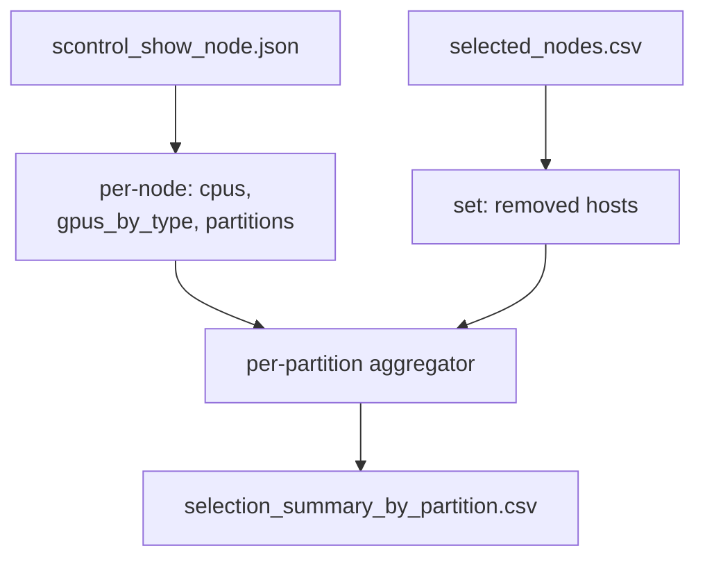

## Goal

For every Slurm partition in `[telegraf_data/scontrol_show_node.json](telegraf_data/scontrol_show_node.json)`, emit one CSV row showing the impact of the reduction selection: how many nodes / CPUs / GPUs the partition has, how many are being removed, and how many remain. GPUs are split out by type so an operator can tell at a glance which accelerator pool is most affected.

Includes **all** partitions and all nodes the partition touches -- not just row 9 / pod A. Nodes outside the row 9 / pod A pool simply contribute "before == after" rows.

## File to add

`[r9_pod_a_pipeline/pipeline/summarize_by_partition.py](r9_pod_a_pipeline/pipeline/summarize_by_partition.py)` -- new stage. Standard library only (csv, json, re, argparse).

## CLI

```text
usage: summarize_by_partition.py [--selected-csv PATH]
                                 [--scontrol-json PATH]
                                 [--output PATH]
```

| Flag | Default | Notes |
| --- | --- | --- |
| `--selected-csv` | `output/selected_nodes.csv` (relative to script dir) | input: which hosts are removed |
| `--scontrol-json` | `../telegraf_data/scontrol_show_node.json` (same default as in `[r9_pod_a_pipeline/pipeline/select_reduction_nodes.py](r9_pod_a_pipeline/pipeline/select_reduction_nodes.py)`) | input: partition / cpu / gres data |
| `--output` | `output/selection_summary_by_partition.csv` | output CSV |

All flags also routed through the orchestrator via `[r9_pod_a_pipeline/run_pipeline.py](r9_pod_a_pipeline/run_pipeline.py)` (no new ones; reuses the existing `--scontrol-json` / `--output-dir`).

## Output schema (wide CSV)

Header order, after the partition column, is fixed: nodes, cpus, total GPUs, then per-type GPUs alphabetically. Per-type columns are added for every GPU type seen anywhere in the JSON, so partitions without that type just show zeros. For each metric the order is `<m>_before, <m>_removed, <m>_after`.

```text
partition,
nodes_before, nodes_removed, nodes_after,
cpus_before,  cpus_removed,  cpus_after,
gpus_total_before, gpus_total_removed, gpus_total_after,
gpus_a100_before,  gpus_a100_removed,  gpus_a100_after,
gpus_a40_before,   gpus_a40_removed,   gpus_a40_after,
gpus_h100_before,  ...
gpus_untyped_before, gpus_untyped_removed, gpus_untyped_after
```

Rows sorted alphabetically by `partition` (matches `[r9_pod_a_pipeline/output/partition_violations.csv](r9_pod_a_pipeline/output/partition_violations.csv)`).

## GPU parsing

Single regex over `node['gres']`:

```python
GRES_GPU = re.compile(r"gpu:(?:([A-Za-z0-9_\-]+):)?(\d+)")
# matches both 'gpu:h100:4' and 'gpu:4'; the type group is None for the latter.
```

For each match: `gpu_type = (m.group(1) or "untyped").lower()`, `count = int(m.group(2))`. Accumulated per node into a dict `{type: count}`. Multiple `gpu:...` chunks in one gres string sum naturally.

`cpu` = `int(node['cpus'])`. Missing / null gres yields an empty dict (no GPUs).

## Algorithm



1. Walk every node in `scontrol_show_node.json["nodes"]`. Compute `(name, cpus, gpus_by_type, partitions)`.
2. Discover the global sorted set of GPU types (across all nodes) -- these become the per-type columns.
3. Load `removed = {host for row in selected_nodes.csv}`.
4. For each partition: aggregate `nodes_before`, `cpus_before`, `gpus_<type>_before` over all member nodes; aggregate the `_removed` quantities only over members in `removed`; compute `_after = _before - _removed`.
5. Write CSV.

Includes a small stderr summary line at the end: `wrote X rows; <total partitions touched by removal> partitions had at least one node removed`.

## Integration points

Two ways to run, both wired up:

1. **Automatic** -- inside `[r9_pod_a_pipeline/pipeline/select_reduction_nodes.py](r9_pod_a_pipeline/pipeline/select_reduction_nodes.py)::run()`, immediately after the existing `selection_summary.csv` write, call `summarize_by_partition.run(...)` so the new CSV always lands beside it.
2. **Standalone** -- `python pipeline/summarize_by_partition.py` (or the orchestrator `run_pipeline.py` continues to invoke it transitively via the reduction step).

The standalone path is what makes it useful for re-generating the partition view after editing `selected_nodes.csv` by hand, or for running it against a different `scontrol_show_node.json` snapshot without re-doing the selection.

## Documentation updates

- `[r9_pod_a_pipeline/README.md](r9_pod_a_pipeline/README.md)`: append a short paragraph under "Reduction outputs" listing `selection_summary_by_partition.csv` and a one-line standalone command.
- `[r9_pod_a_pipeline/DESIGN.md](r9_pod_a_pipeline/DESIGN.md)`: add the new artifact to the downstream-artifacts table.
- `[telegraf_data/AGENT_INSTRUCTIONS.md](telegraf_data/AGENT_INSTRUCTIONS.md)`: add the new CSV to the list of reduction outputs in the "Opt-in downstream" section.

## Verification

Run via `python run_pipeline.py --with-reduction --skip-export` and spot-check:

- Row count = number of distinct partitions in the JSON (164).
- For a partition entirely outside the removable pool (e.g. `mit_data_transfer`): `nodes_removed == 0`, all `_after == _before`.
- For a tight partition we already know is hit (e.g. `pi_dbertsim`, `pi_gaias` from `partition_violations.csv`): `nodes_removed > 0`, `nodes_after = nodes_before - nodes_removed`, and CPU / GPU totals shrink consistently.
- `awk -F, 'NR>1 {sum+=$3} END {print sum}'` over `nodes_removed` should equal **the count of distinct partitions each removed host belongs to, summed** (i.e. each removed host contributes once per partition it is a member of). Sanity-check against a hand calculation for one host.

## Out of scope

- xlsx output. The user's default name is `.csv` and the project is std-lib only; if a true xlsx is wanted later, a 5-line `openpyxl` writer can be added without changing the schema.
- Tracking `gres_used` (currently allocated GPUs). The user asked about totals; utilization can be added as another metric triplet later.
- Long format (one row per partition x gpu_type). The wide schema is more spreadsheet-friendly and easier to diff.