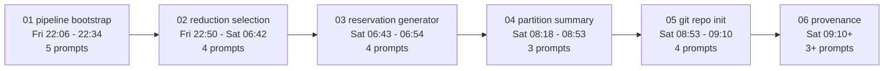

## Sources of truth

| Artifact | Where it lives today | What we keep |
| --- | --- | --- |
| Original spec (pre-session) | preserved verbatim at the bottom of `[telegraf_data/AGENT_INSTRUCTIONS.md](telegraf_data/AGENT_INSTRUCTIONS.md)` under "Original spec" | extracted to `provenance/context/original_AGENT_INSTRUCTIONS.md` |
| Updated spec (post-session) | current `[telegraf_data/AGENT_INSTRUCTIONS.md](telegraf_data/AGENT_INSTRUCTIONS.md)` | copied to `provenance/context/updated_AGENT_INSTRUCTIONS.md` |
| Formal plans (6 files) | `~/.cursor/plans/*.md`: `r9_pod_a_power_pipeline_87f66f38`, `cabinet_power_reduction_selection_745e24c8`, `slurm_reservation_generator_ea0910d3` (+ earlier draft `57dffe96`), `partition_impact_summary_11bf9529`, `init_r9_pipeline_git_repo_11e69107`, plus the one this plan creates | copied verbatim into the relevant phase directories |
| Verbatim user prompts (23) | `~/.cursor/projects/Users-cnh-projects-power-work-r9/agent-transcripts/fec1d6d6-3e05-4db6-99ec-6d712cea59ee/fec1d6d6-...jsonl` -- text inside `<user_query>...</user_query>` framing | extracted per phase to `user_prompts.md` |
| Visible assistant responses (136) | same JSONL, assistant `text` content blocks (no internal `thinking`) | extracted per phase to `assistant_responses.md` |
| AskQuestion / user answers | embedded in the JSONL as tool calls + tool results | extracted per phase to `clarifications.md` |
| Distilled decisions, mid-flight bug fixes, post-delivery iterations | reconstructed by hand from the transcript and the resulting code/docs | written per phase as `decisions.md` and (when applicable) `change_requests.md` |

Parent transcript UUID `fec1d6d6-3e05-4db6-99ec-6d712cea59ee` will be cited at the top of `provenance/README.md` so anyone re-running the extraction script can verify against the same source.

## Directory layout

```text
r9_pod_a_pipeline/
  provenance/
    README.md                          # nav, sourcing notes, parent transcript UUID, schema of each file
    TIMELINE.md                        # chronological one-pager linking every phase

    context/
      original_AGENT_INSTRUCTIONS.md   # pre-session spec (extracted from current file's blockquote)
      updated_AGENT_INSTRUCTIONS.md    # post-session spec (current file)

    scripts/
      extract_session.py               # one-shot extractor (re-runnable)

    phases/
      01-pipeline-bootstrap/
        README.md                      # narrative: what came in, decided, built, fixed, iterated
        plan.md                        # verbatim r9_pod_a_power_pipeline_87f66f38.plan.md
        user_prompts.md                # verbatim, chronological
        assistant_responses.md         # verbatim text-content blocks, chronological
        clarifications.md              # AskQuestion title + options + user choice
        decisions.md                   # bullet list of key trade-offs the phase resolved
        change_requests.md             # 16.5 / 33 / 49.5 kW reference-lines refinement

      02-reduction-selection/
        README.md
        plan.md                        # verbatim cabinet_power_reduction_selection_745e24c8.plan.md
        user_prompts.md
        assistant_responses.md
        clarifications.md              # at-peak vs true-peak; infeasibility behavior
        decisions.md
        change_requests.md             # restoration of zero-remaining; avg-after bar; stats text box

      03-reservation-generator/
        README.md
        plan.md                        # verbatim ..._ea0910d3.plan.md
        plan_draft_superseded.md       # verbatim ..._57dffe96.plan.md (earlier draft, kept for transparency)
        user_prompts.md
        assistant_responses.md
        decisions.md
        change_requests.md             # SPEC_NODES added, then removed (Slurm sets it itself)

      04-partition-summary/
        README.md
        plan.md                        # verbatim partition_impact_summary_11bf9529.plan.md
        user_prompts.md
        assistant_responses.md
        decisions.md
        change_requests.md             # filter to non-zero rows + compact _pre/_rm/_post headers

      05-git-repo-init/
        README.md
        plan.md                        # verbatim init_r9_pipeline_git_repo_11e69107.plan.md
        user_prompts.md
        assistant_responses.md
        clarifications.md              # nested-repo handling (asked, then user clarified scope)
        decisions.md

      06-provenance/
        README.md                      # this phase, post-execution (writes itself)
        plan.md                        # verbatim of THIS plan
        user_prompts.md                # the prompts in this phase
        assistant_responses.md
        clarifications.md              # the depth question above (lean / narrative / full_log)
        decisions.md
```

About 42 markdown files plus one Python script. ~250-300 KB total -- well under the size of any single CSV the pipeline already tracks.

## Phase boundaries

Mapping the 23 user prompts to phases (from the JSONL timestamps):



The extraction script uses these as user-message-index ranges (hard-coded after a one-shot `extract_session.py --list` to print all timestamps, then frozen). Phase 06 is open-ended -- it captures whatever has been said by the time the script is invoked.

## Extraction script

`provenance/scripts/extract_session.py`. Standard library only.

```python
# Pseudocode shape
TRANSCRIPT = "<absolute path to the parent JSONL>"
PARENT_UUID = "fec1d6d6-3e05-4db6-99ec-6d712cea59ee"

# Hard-coded phase ranges over the *user* messages, not the raw record stream.
PHASES = [
    ("01-pipeline-bootstrap",  0,  4),
    ("02-reduction-selection", 5,  8),
    ("03-reservation-generator", 9, 12),
    ("04-partition-summary",   13, 15),
    ("05-git-repo-init",       16, 19),
    ("06-provenance",          20, None),  # open-ended
]

def main():
    parser = argparse.ArgumentParser()
    parser.add_argument("--list", action="store_true",
                        help="print '<idx>  <timestamp>  <first 80 chars>' for every user message and exit")
    parser.add_argument("--out", default=os.path.join(THIS_DIR, "..", "phases"))
    ...
    # For each phase:
    #   - write user_prompts.md (verbatim text content from each user message,
    #     stripping only the surrounding <timestamp>/<user_query>/<system_reminder>
    #     framing tags so the captured prompt reads cleanly; preserve the
    #     timestamp as a markdown heading per prompt).
    #   - write assistant_responses.md (every assistant message between two
    #     consecutive user messages in this phase; emit only `text` blocks,
    #     skipping `thinking` and `tool_use` -- but for tool_use, write a
    #     one-line italic stub like '[ran Shell: <description>]' so context
    #     is preserved without dumping huge tool outputs).
    #   - write clarifications.md only when the phase contains an
    #     AskQuestion tool_use; emit the question, options, and the user's
    #     answer pulled from the next tool_result.
```

The script never needs to be re-run unless we want to refresh from the transcript -- the extracted markdown files are the source of truth checked in.

## What goes in each `decisions.md` (concrete examples)

Phase 01:
- New top-level directory chosen over refactoring `telegraf_data/` (clarification answer).
- One agent plays all four spec roles sequentially (clarification answer); the artifact mapping (`sql/` = DB expert; `pipeline/*.py` = software engineer; `DESIGN.md` = architect; `README.md` = docs) preserved as the natural division of labour.
- `sys_power` priority encoded once in `[r9_pod_a_pipeline/sql/02_host_sensor_map.sql](r9_pod_a_pipeline/sql/02_host_sensor_map.sql)` via `bool_or` `CASE` so downstream stages never re-derive it.
- Host-name irregularity (`split_part(node_name,'-',1)`) confined to the same SQL file.
- Bar plot semantics literal to spec: `min_t(sum_h power)` (instantaneous) -- explicitly different from the legacy `sum_h(min_t)`.
- Mid-flight bug discovered: psycopg2 doesn't strip `--` SQL comments before scanning for `%(name)s` placeholders, so a comment containing `%(pairs)s` raised `KeyError: 'pairs'`. Fix recorded.
- Credentials switched from `postgres` to `readonly_user` to match the spec.

Phase 02 (similarly): at-peak vs true-peak, retry-with-seeds vs hard-fail, restoration RNG seeding policy, plot bar definitions and width tightening.
Phase 03: standalone vs auto-chained (chose standalone), reservation-name format, time format, default user, SPEC_NODES correction.
Phase 04: wide vs long format, GPU type auto-discovery, untyped bucket, default filter, compact suffix scheme, auto-chained from `select_reduction_nodes.run()`.
Phase 05: scope (only `r9_pod_a_pipeline/`), `main` branch, single import commit, no git config changes, external-path dependency on `../telegraf_data/scontrol_show_node.json` flagged as future work.

## What goes in each `change_requests.md`

Per-phase changelog of refinements the user requested AFTER the initial implementation landed:

- 01: add three dashed reference lines at 16.5 / 33 / 49.5 kW.
- 02: restore one host per zero-remaining partition; add `avg_after` bar; add summary-stats text box on the with-reduction plot.
- 03: add `SPEC_NODES`; immediately undo it (Slurm sets it implicitly).
- 04: filter to partitions with at least one removed node by default (with `--include-untouched` opt-out); compact headers (`_pre/_rm/_post`; drop `gpus_` prefix on per-type GPU columns).
- 05: none.

## Doc updates outside `provenance/`

- `[r9_pod_a_pipeline/README.md](r9_pod_a_pipeline/README.md)` -- one short paragraph at the bottom: "Session provenance lives under `provenance/` (plans, prompts, decisions, narrative)."
- `[r9_pod_a_pipeline/DESIGN.md](r9_pod_a_pipeline/DESIGN.md)` -- one bullet under the existing layout note pointing readers at `provenance/TIMELINE.md`.

## Commit strategy

Single follow-up commit titled `Add provenance subdirectory: plans, prompts, decisions, transcript extracts`, with a body listing the directory layout and the parent transcript UUID. Lands on `main` directly after the existing root-commit `d6bb680`.

## Verification

After running the extraction:
1. `find provenance -name '*.md' | wc -l` reports ~42.
2. `wc -l provenance/phases/*/user_prompts.md` totals 23 separator headings (one per user prompt across all phases).
3. Spot-read `provenance/phases/01-pipeline-bootstrap/user_prompts.md` -- first prompt is "read the file AGENT_INSTRUCTIONS.md and make a detailed plan for how to execute the plan."
4. Spot-read `provenance/phases/03-reservation-generator/change_requests.md` -- mentions both `SPEC_NODES` add and removal with the user's explanation.
5. `git status` clean after the new commit; `git log --stat -2` shows the two commits with sensible diff sizes.

## Out of scope

- Preserving internal `thinking` blocks. The user chose "full_log" but the transcripts I produce are visible-only by design; thinking blocks were never user-facing and are noisy.
- Capturing tool_use payloads (full Shell output, full file reads). Replaced by one-line stubs (`[Shell: <description>]`) inside `assistant_responses.md` so the narrative isn't broken but the size stays sane.
- Tracking subagent transcripts. None were spawned this session, and the system instructions forbid citing subagent UUIDs anyway.
- Pulling the parent JSONL itself into git. It's external and large; the extraction script + checked-in markdown is the intended snapshot.